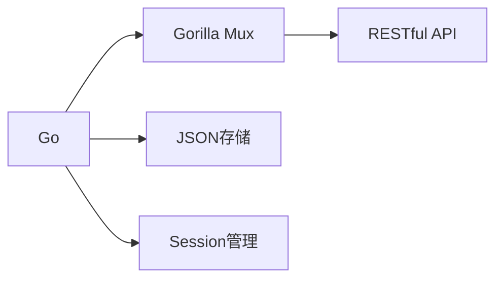
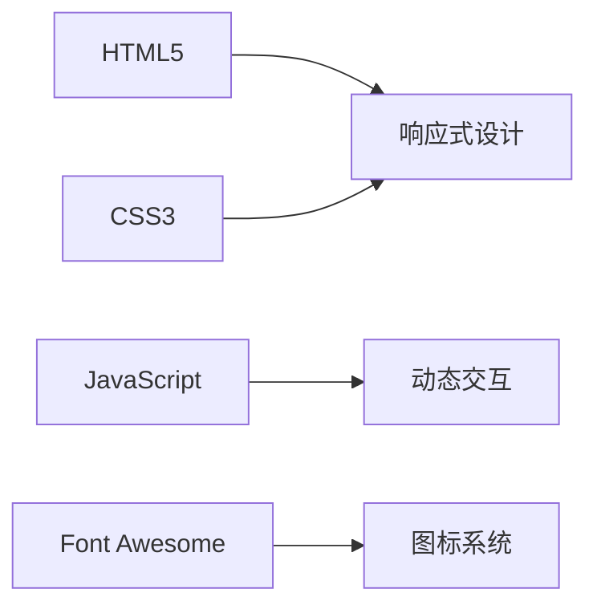

# 🚀 E-Nav 导航站

<div align="left">


<p>一个优雅、现代的个人导航站解决方案，让您的网址管理更轻松、更智能！制作不易，欢迎点个免费的Star⭐</p>

[演示站点](https://enavdemo.ecouu.com) | [使用文档](https://github.com/ecouus/E-Nav/blob/main/README.md) | [问题反馈](https://github.com/ecouus/E-Nav/issues)
</div>


## 🚀 快速部署

**Docker Compose 部署**
#### 下载源文件
```bash
sudo apt install git -y && git clone https://github.180280.xyz/https://github.com/Yeqingky/E-Nav.git && cd E-Nav 
```
根据需要编辑 `docker-compose.yml` 文件
#### 启动
```bash
docker-compose up -d
```
#### 更新
```bash
docker-compose pull && docker-compose up -d
```

## 🛠️ 技术架构

### 后端技术


### 前端技术



## 📦 项目结构

```
e-nav/
├── 📄 main.go         # 主程序
├── 📁 static/        # 静态文件目录
│   ├── 📄 css/       # CSS文件
│   ├── 📄 js/        # JavaScript文件
│   └── 📄 favicon.ico # 网站图标
├── 📁 templates/     # HTML模板目录
│   ├── 📄 index.html         # 主页模板
│   ├── 📄 admin_login.html   # 管理员登录页面
│   └── 📄 admin_dashboard.html # 管理员控制面板
├── 📁 data/     # 数据文件
	├── 📄 bookmarks.json  # 数据存储
	└── 📄 config.json     # 配置文件
```

## 🔧 常用命令

```bash
# Docker 环境
docker ps                # 查看容器状态
docker logs e-nav       # 查看运行日志
docker restart e-nav    # 重启服务
docker stop e-nav      # 停止服务
docker start e-nav     # 启动服务


## 🤝 联系我们
- 📮 Email: admin@ecouu.com
- 💬 Telegram: [@cmin2_bot](https://t.me/cmin2_bot)
- 🌟 [GitHub Issues](https://github.com/ecouus/E-Nav/issues)

## 版权所有 (Copyright)
© 2025 ecouus 保留所有权利 (All Rights Reserved)
## 使用限制
1. 禁止任何形式的商业转售
2. 禁止未经授权的商业使用
3. 禁止去除或修改本版权声明
4. 禁止声称拥有本项目的所有权
## 解释权
本项目的最终解释权归 ecouus 所有。任何对项目的理解和使用，均以 ecouus 的官方解释为准。
## 免责声明
本项目基于 MIT 许可证开源，但对于任何非法的使用，ecouus 保留追究法律责任的权利。

## 📜 开源协议
本项目采用 [MIT License](https://github.com/ecouus/E-Nav/blob/main/LICENSE) 协议开源。

---

<p align="center">Made with ❤️ by ecouus</p>


